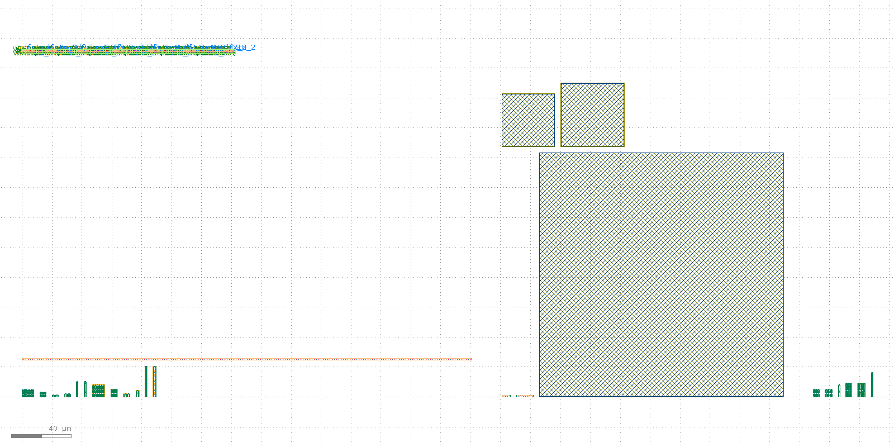

# PLL layout record: 20260819-082044-d3af784

Device-level layout of the closed-loop PLL schematic (`design/top/netlist/top.spice`), drawn by `layout/bin/run-pll-layout-flow.sh` (issue #16). Read this file first; everything else in this directory is the raw `klt` evidence it summarises.

## Overall verdict: PASS

- [x] Every device card in the schematic netlist drew a layout primitive -- pfd_cp: 60 -> 60, loop_filter: 5 -> 5, vco_ring5: 26 -> 26, divider_intN: 29 -> 29
- [x] Every MOS device is a sky130 1.8 V core device (DR-001) -- no 3.3 V-class device is drawn -- sky130_fd_pr__nfet_01v8, sky130_fd_pr__pfet_01v8
- [x] `pfd_cp`: the `(class, W, L)` device multiset extracted from the drawn GDS equals the schematic's -- MOS 59, R 1, C 0
- [x] `loop_filter`: the `(class, W, L)` device multiset extracted from the drawn GDS equals the schematic's -- MOS 0, R 2, C 3
- [x] `vco_ring5`: the `(class, W, L)` device multiset extracted from the drawn GDS equals the schematic's -- MOS 26, R 0, C 0
- [x] `divider_intN`: the composed cell instantiates exactly the schematic's 29 standard-cell instances, each from the library cell the schematic names -- pll_divider_intN: 29 instances, 29 distinct library cells placed
- [x] `pll_top` instantiates all 4 block cells -- pll_divider_intN__pll_divider_intN, pll_loop_filter__pll_loop_filter, pll_pfd_cp__pll_pfd_cp, pll_vco_ring5__pll_vco_ring5
- [x] DRC fires exactly one rule class -- the documented `klt gen` minimum-gate-length limitation -- once per minimum-length device (52 of them), and nothing else -- status=violations, rule_counts={'li1.space.1': 52}

## What this layout is

A **device-level floorplan**: every device the schematic declares is physically drawn, at the schematic's own W/L, in a matched array grouped by `(flavor, W, L)`, and the four blocks are composed into one `pll_top` cell. The device set is derived from the schematic netlist at build time -- nothing about it is typed in by hand -- which is what makes the device-set checks above reproducible rather than declarative.

(All layers, `klt render`. Left to right in the strip along the top: the divider's standard-cell row; below it the PFD/charge pump's device groups and its 300 um bias resistor; right: the loop filter's three MiM capacitors; far right: the VCO's ring and buffer devices.)

| Block | Cell | Schematic devices | Groups | Placed size (um) |
| --- | --- | --- | --- | --- |
| `pfd_cp` | `pll_pfd_cp` | 60 | 13 | 300.84 x 25.72 |
| `loop_filter` | `pll_loop_filter` | 5 | 5 | 188.38 x 209.8 |
| `vco_ring5` | `pll_vco_ring5` | 26 | 6 | 40.06 x 16.72 |
| `divider_intN` | `pll_divider_intN` | 29 | 29 | 142.6 x 2.72 |
| **top** | `pll_top` | 120 | 4 | 569.13 x 233.0 |

## What this layout is not

- **Not routed.** No inter-device interconnect is drawn. The full schematic topology *is* recorded, machine-derived, in `plan.json` (every group member carries its schematic device name and its port-to-net mapping), and 60 nets are declared across the four blocks -- but the composed GDS carries no wires between them. See the routing spot-check below for why.
- **Not DRC-clean.** 52 violations, all of one rule class (see the DRC check above); DRC-clean closure is issue #17.
- **Not LVS-clean, and not LVS-compared.** With no routing there is no topology in the stream to compare, so no LVS run is attempted here at all rather than reporting a foregone mismatch. LVS closure is issue #18.
- **Not a verified circuit.** Nothing here is a claim against `spec/target-spec.md`; no simulation was run from this layout (PEX is issue #21).

## Routing spot-check (why the shipped layout is unrouted)

The same build was re-run with `klt gen-compose`'s router enabled (`route-spot-check/`). Of 60 declared nets it drew 1 in full and 8 in part, leaving 51 with no geometry at all -- 51 of 900 two-pin legs drawn. The router declined the rest, with its own reason per leg:

| Why a leg was not drawn | Legs |
| --- | --- |
| would cross an already-drawn route (the router's own route-vs-route collision check, klayout-tools#1057) | 302 |
| backbone would plough through its own pin's block (no routing channel inside a matched array) | 277 |
| backbone would plough through an unrelated block's bbox (no routing channel between abutted groups) | 141 |
| terminates on a bare-poly gate with no contacted landing pad (`params.gate_contact`, klayout-tools#492 -- this flow does not opt in) | 129 |

**The drawn geometry still shorts 1 node.** The routed run's own extracted netlist collapses 2 distinct declared net names onto 1 electrical node:

- `DN|GND`

That is why the shipped stream is still the unrouted one: a layout that shorts nets the schematic keeps apart is worse than one with no wires, and nothing downstream (#17's DRC closure, #18's LVS closure) can be argued from it. The residual short survives the router's own route-vs-route check (which this `klt` pin does have, and which fires on the legs counted in the table above); it is a coverage gap in that check, reproduced on `klt`'s own default generator output and filed upstream as [klayout-tools#1197](https://github.com/2AMLogic/klayout-tools/issues/1197).

Its DRC reports 54 violations ({'li1.space.1': 52, 'met1.space.1': 2}) against 52 for the unrouted build, and its extraction finds 476 nets against 528 for the unrouted build. Most of that difference is the routing doing its job -- each drawn leg merges two device pads that the unrouted stream counts as two separate nets -- which is why the multi-label node count above, not the net-count delta, is what identifies a short.

Per-block routing outcome from the spot-check:

| Block | Declared nets | Fully routed | Not fully routed |
| --- | --- | --- | --- |
| `pfd_cp` | 35 | 1 | 34 |
| `loop_filter` | 4 | 0 | 4 |
| `vco_ring5` | 21 | 0 | 21 |
| `divider_intN` | 0 | 0 | 0 |

(The spot-check's own GDS streams are deleted by the flow after its DRC/extract run -- the JSON envelopes are the evidence, and `run-pll-layout-flow.sh` regenerates the streams on demand.)

## Device set: schematic vs. extracted

`klt extract` reads the drawn stream back into a netlist with no knowledge of the plan that produced it, so this table compares two independently-derived multisets.

| Block | Kind | Schematic (from netlist) | Extracted (from GDS) | Match |
| --- | --- | --- | --- | --- |
| `pfd_cp` | MOS (class, W um, L um) | 59: 18x nfet/1/0.15; 6x nfet/1/0.3; 2x nfet/1/1; 1x nfet/10/0.15; 1x nfet/10/1; 2x nfet/2/1; 18x pfet/2/0.15; 6x pfet/2/0.3; 2x pfet/2/1; 1x pfet/20/0.15; 1x pfet/20/1; 1x pfet/4/1 | 59: 18x nfet/1/0.15; 6x nfet/1/0.3; 2x nfet/1/1; 1x nfet/10/0.15; 1x nfet/10/1; 2x nfet/2/1; 18x pfet/2/0.15; 6x pfet/2/0.3; 2x pfet/2/1; 1x pfet/20/0.15; 1x pfet/20/1; 1x pfet/4/1 | yes |
| `pfd_cp` | resistors (class, ohm) | 1: 1x res_xhigh_po/600000 | 1: 1x res_xhigh_po/600000 | yes |
| `loop_filter` | resistors (class, ohm) | 2: 1x res_xhigh_po/10000; 1x res_xhigh_po/20600 | 2: 1x res_xhigh_po/10000; 1x res_xhigh_po/20600 | yes |
| `loop_filter` | capacitors (class, F) | 3: 1x sky130_fd_pr__model__cap_mim/2.4766e-12; 1x sky130_fd_pr__model__cap_mim/3.55992e-12; 1x sky130_fd_pr__model__cap_mim/5.32619e-11 | 3: 1x sky130_fd_pr__model__cap_mim/2.4766e-12; 1x sky130_fd_pr__model__cap_mim/3.55992e-12; 1x sky130_fd_pr__model__cap_mim/5.32619e-11 | yes |
| `vco_ring5` | MOS (class, W um, L um) | 26: 6x nfet/2/0.15; 6x nfet/2/0.5; 1x nfet/8/0.15; 1x pfet/16/0.15; 6x pfet/4/0.15; 6x pfet/4/0.5 | 26: 6x nfet/2/0.15; 6x nfet/2/0.5; 1x nfet/8/0.15; 1x pfet/16/0.15; 6x pfet/4/0.15; 6x pfet/4/0.5 | yes |

The standard-cell block extracts as 454 transistors rather than its 29 schematic instances -- those are the library cells' own internal devices, which is what a standard-cell block's layout *is*; the instance-level check above is the one that compares like with like.

## Flow

1. `pll_layout.py` parses the schematic netlist and derives the plan (`plan.json`).
2. `klt gen mos_array` / `klt gen res_array` per matched device group.
3. `klt draw` per MiM capacitor (plate geometry -- no generator exists; see README).
4. Each divider standard cell is taken from the PDK's own library GDS.
5. `klt gen-compose` (explicit placement) per block, then once more for the top cell.
6. `klt drc` / `klt extract` / `klt cells` over the result -- the evidence in this directory.

## Provenance

- Record ID: `20260819-082044-d3af784`
- Schematic netlist: `design/top/netlist/top.spice`
- `klt` version: `klt 0.2.0` (see `layout/requirements.txt`)
- KLayout engine version: `0.30.10`
- PDK: `sky130A`, `open_pdks c6d73a35f524070e85faff4a6a9eef49553ebc2b`
- PDK pin cross-check: compare `version` above against `sim/pdk.json`'s `open_pdks_commit` -- this flow does not itself enforce the pin, so a mismatch is a manual reproducibility note.
- Repo state: `d3af784f692ff206fec251b72532f779e8f84f3d` on `feature/issue-46`

## Links

- [`plan.json`](plan.json) -- the schematic-derived layout plan (device set + full port/net map)
- [`build.json`](build.json) -- placement/composition summary
- [`pll_top.gds`](pll_top.gds) -- **the layout**
- [`drc.json`](drc.json), [`extract.json`](extract.json), [`pll_top.spice`](pll_top.spice)
- [`cells.top.json`](cells.top.json) -- composed cell hierarchy
- [`renders/overview.png`](renders/overview.png), [`render.json`](render.json)
- [`report.md`](report.md) -- combined `klt report --format github-summary` rendering

