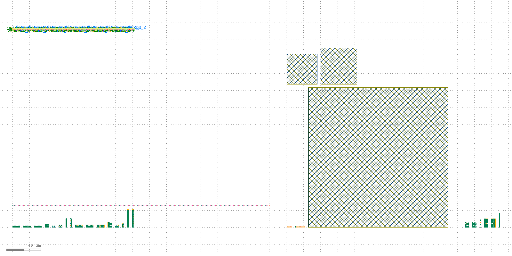

# PLL layout record: 20260906-195205-4a08c71

Device-level layout of the closed-loop PLL schematic (`design/top/netlist/top.spice`), drawn by `layout/bin/run-pll-layout-flow.sh` (issue #16). Read this file first; everything else in this directory is the raw `klt` evidence it summarises.

## Overall verdict: PASS

- [x] Every device card in the schematic netlist drew a layout primitive -- pfd_cp: 60 -> 60, loop_filter: 5 -> 5, vco_ring5: 26 -> 26, divider_intN: 29 -> 29
- [x] Every MOS device is a sky130 1.8 V core device (DR-001) -- no 3.3 V-class device is drawn -- sky130_fd_pr__nfet_01v8, sky130_fd_pr__pfet_01v8
- [x] `pfd_cp`: the `(class, W, L)` device multiset extracted from the drawn GDS equals the schematic's -- MOS 59, R 1, C 0
- [x] `loop_filter`: the `(class, W, L)` device multiset extracted from the drawn GDS equals the schematic's -- MOS 0, R 2, C 3
- [x] `vco_ring5`: the `(class, W, L)` device multiset extracted from the drawn GDS equals the schematic's -- MOS 26, R 0, C 0
- [x] `divider_intN`: the composed cell instantiates exactly the schematic's 29 standard-cell instances, each from the library cell the schematic names -- pll_divider_intN: 29 instances, 29 distinct library cells placed
- [x] `pll_top` instantiates all 4 block cells -- pll_divider_intN__pll_divider_intN, pll_loop_filter__pll_loop_filter, pll_pfd_cp__pll_pfd_cp, pll_vco_ring5__pll_vco_ring5
- [x] DRC is clean -- zero violations (previously 52 `li1.space.1` violations, one per minimum-gate-length device, traced to klayout-tools#1187 and fixed upstream by klayout-tools#1201) -- status=clean, violation_count=0, rule_counts={}

## What this layout is

A **device-level floorplan**: every device the schematic declares is physically drawn, at the schematic's own W/L, in a matched array grouped by `(flavor, W, L)`, and the four blocks are composed into one `pll_top` cell. The device set is derived from the schematic netlist at build time -- nothing about it is typed in by hand -- which is what makes the device-set checks above reproducible rather than declarative.

(All layers, `klt render`. Left to right in the strip along the top: the divider's standard-cell row; below it the PFD/charge pump's device groups and its 300 um bias resistor; right: the loop filter's three MiM capacitors; far right: the VCO's ring and buffer devices.)

| Block | Cell | Schematic devices | Groups | Placed size (um) |
| --- | --- | --- | --- | --- |
| `pfd_cp` | `pll_pfd_cp` | 60 | 17 | 300.84 x 26.12 |
| `loop_filter` | `pll_loop_filter` | 5 | 5 | 188.38 x 209.8 |
| `vco_ring5` | `pll_vco_ring5` | 26 | 6 | 40.86 x 17.12 |
| `divider_intN` | `pll_divider_intN` | 29 | 29 | 142.6 x 2.72 |
| **top** | `pll_top` | 120 | 4 | 569.93 x 233.0 |

## What this layout is not

- **Not routed.** No inter-device interconnect is drawn. The full schematic topology *is* recorded, machine-derived, in `plan.json` (every group member carries its schematic device name and its port-to-net mapping), and 60 nets are declared across the four blocks -- but the composed GDS carries no wires between them. See the routing spot-check below for why.
- **DRC-clean.** 0 violations (see the DRC check above) -- issue #17. Through issue #46's `klt` pin this reported 52 `li1.space.1` violations, one per minimum-gate-length device, traced to a documented `klt gen` limitation (klayout-tools#1187); issue #17 bumped the pin past the upstream fix (klayout-tools#1201) and the violation is gone.
- **Not LVS-clean.** The shipped stream carries no routing, so no `klt lvs` run is attempted against it (a foregone mismatch is not evidence). `klt lvs` *is* run against the routed routing-spot-check build below, and reports a large, honestly-recorded mismatch -- see the spot-check's own LVS section for the counts and why. LVS closure is issue #18.
- **Not a verified circuit.** Nothing here is a claim against `spec/target-spec.md`; no simulation was run from this layout (PEX is issue #21).

## Routing spot-check (why the shipped layout is unrouted)

The same build was re-run with `klt gen-compose`'s router enabled (`route-spot-check/`). Of 60 declared nets it drew 2 in full and 20 in part, leaving 38 with no geometry at all -- 66 of 926 two-pin legs drawn. The router declined the rest, with its own reason per leg:

| Why a leg was not drawn | Legs |
| --- | --- |
| backbone would plough through its own pin's block (no routing channel inside a matched array) | 371 |
| would cross an already-drawn route (the router's own route-vs-route collision check, klayout-tools#1057) | 354 |
| backbone would plough through an unrelated block's bbox (no routing channel between abutted groups) | 127 |
| other | 8 |

**No drawn short:** the routed run's extracted netlist carries no multi-label node, so nothing the router drew merged two declared nets. The shipped stream is still the unrouted one because most nets remain undrawn (see the table above), not because the drawn ones are wrong.

Its DRC reports 2 violations ({'met1.space.1': 2}) against 0 for the unrouted build, and its extraction finds 463 nets against 530 for the unrouted build. Most of that difference is the routing doing its job -- each drawn leg merges two device pads that the unrouted stream counts as two separate nets -- which is why the multi-label node count above, not the net-count delta, is what identifies a short.

Per-block routing outcome from the spot-check:

| Block | Declared nets | Fully routed | Not fully routed |
| --- | --- | --- | --- |
| `pfd_cp` | 35 | 2 | 33 |
| `loop_filter` | 4 | 0 | 4 |
| `vco_ring5` | 21 | 0 | 21 |
| `divider_intN` | 0 | 0 | 0 |

(The spot-check's own GDS streams are deleted by the flow after its DRC/extract run -- the JSON envelopes are the evidence, and `run-pll-layout-flow.sh` regenerates the streams on demand.)

### LVS (spot-check)

`klt lvs` compared the spot-check's routed `pll_top` against the authored schematic (`reference.spice`, the same netlist `pll_layout.py` derives the plan from, with its top level's `.subckt`/`.ends` uncommented so `klt lvs`'s SPICE reader recognises it -- both sides flattened first, since this flow's composed block names (`pll_pfd_cp`, ...) differ from the schematic's own subcircuit names (`pfd_cp`, ...) and `klt lvs` does not resolve that across un-flattened circuit boundaries).

**Status: `mismatch`, 1164 mismatches** -- nets 0/90 reference nets matched (463 in the layout), devices 0/91 reference devices matched (545 in the layout).

| Mismatch category | Count |
| --- | --- |
| `device.unmatched` | 636 |
| `net.unmatched` | 525 |
| `device.body_unverified` | 1 |
| `topology` | 1 |
| `topology.flattened` | 1 |

This is the expected shape of the result, not a surprise: only 66 of 926 two-pin legs are drawn (see the table above), so almost every reference net and device is structurally unreachable from the layout side. `klt lvs` is run and its result recorded in full precisely so that claim rests on the tool's own comparison rather than on this record's own leg-reason tally -- per this repo's CLAUDE.md, a miss is recorded as a miss, never rounded up to "clean." Full `klt lvs` closure (issue #18) needs the router's structural gaps above (chiefly the point-to-point router's inability to route a pin buried inside a matched device array) closed first, and klayout-tools#1197's residual same-block short fixed upstream before routing further is safe to attempt at all -- see `layout/pll/README.md`.

## Device set: schematic vs. extracted

`klt extract` reads the drawn stream back into a netlist with no knowledge of the plan that produced it, so this table compares two independently-derived multisets.

| Block | Kind | Schematic (from netlist) | Extracted (from GDS) | Match |
| --- | --- | --- | --- | --- |
| `pfd_cp` | MOS (class, W um, L um) | 59: 18x nfet/1/0.15; 6x nfet/1/0.3; 2x nfet/1/1; 1x nfet/10/0.15; 1x nfet/10/1; 2x nfet/2/1; 18x pfet/2/0.15; 6x pfet/2/0.3; 2x pfet/2/1; 1x pfet/20/0.15; 1x pfet/20/1; 1x pfet/4/1 | 59: 18x nfet/1/0.15; 6x nfet/1/0.3; 2x nfet/1/1; 1x nfet/10/0.15; 1x nfet/10/1; 2x nfet/2/1; 18x pfet/2/0.15; 6x pfet/2/0.3; 2x pfet/2/1; 1x pfet/20/0.15; 1x pfet/20/1; 1x pfet/4/1 | yes |
| `pfd_cp` | resistors (class, ohm) | 1: 1x res_xhigh_po/600000 | 1: 1x res_xhigh_po/600000 | yes |
| `loop_filter` | resistors (class, ohm) | 2: 1x res_xhigh_po/10000; 1x res_xhigh_po/20600 | 2: 1x res_xhigh_po/10000; 1x res_xhigh_po/20600 | yes |
| `loop_filter` | capacitors (class, F) | 3: 1x sky130_fd_pr__model__cap_mim/2.4766e-12; 1x sky130_fd_pr__model__cap_mim/3.55992e-12; 1x sky130_fd_pr__model__cap_mim/5.32619e-11 | 3: 1x sky130_fd_pr__model__cap_mim/2.4766e-12; 1x sky130_fd_pr__model__cap_mim/3.55992e-12; 1x sky130_fd_pr__model__cap_mim/5.32619e-11 | yes |
| `vco_ring5` | MOS (class, W um, L um) | 26: 6x nfet/2/0.15; 6x nfet/2/0.5; 1x nfet/8/0.15; 1x pfet/16/0.15; 6x pfet/4/0.15; 6x pfet/4/0.5 | 26: 6x nfet/2/0.15; 6x nfet/2/0.5; 1x nfet/8/0.15; 1x pfet/16/0.15; 6x pfet/4/0.15; 6x pfet/4/0.5 | yes |

The standard-cell block extracts as 454 transistors rather than its 29 schematic instances -- those are the library cells' own internal devices, which is what a standard-cell block's layout *is*; the instance-level check above is the one that compares like with like.

## Flow

1. `pll_layout.py` parses the schematic netlist and derives the plan (`plan.json`).
2. `klt gen mos_array` / `klt gen res_array` per matched device group.
3. `klt draw` per MiM capacitor (plate geometry -- no generator exists; see README).
4. Each divider standard cell is taken from the PDK's own library GDS.
5. `klt gen-compose` (explicit placement) per block, then once more for the top cell.
6. `klt drc` / `klt extract` / `klt cells` over the result -- the evidence in this directory.

## Provenance

- Record ID: `20260906-195205-4a08c71`
- Schematic netlist: `design/top/netlist/top.spice`
- `klt` version: `klt 0.4.0` (see `layout/requirements.txt`)
- KLayout engine version: `0.30.12`
- PDK: `sky130A`, `open_pdks c6d73a35f524070e85faff4a6a9eef49553ebc2b`
- PDK pin cross-check: compare `version` above against `sim/pdk.json`'s `open_pdks_commit` -- this flow does not itself enforce the pin, so a mismatch is a manual reproducibility note.
- Repo state: `4a08c71d1555545c568184babad0979b6a8962ab` on `feature/issue-18` (dirty)

## Links

- [`plan.json`](plan.json) -- the schematic-derived layout plan (device set + full port/net map)
- [`build.json`](build.json) -- placement/composition summary
- [`pll_top.gds`](pll_top.gds) -- **the layout**
- [`drc.json`](drc.json), [`extract.json`](extract.json), [`pll_top.spice`](pll_top.spice)
- [`cells.top.json`](cells.top.json) -- composed cell hierarchy
- [`renders/overview.png`](renders/overview.png), [`render.json`](render.json)
- [`report.md`](report.md) -- combined `klt report --format github-summary` rendering

